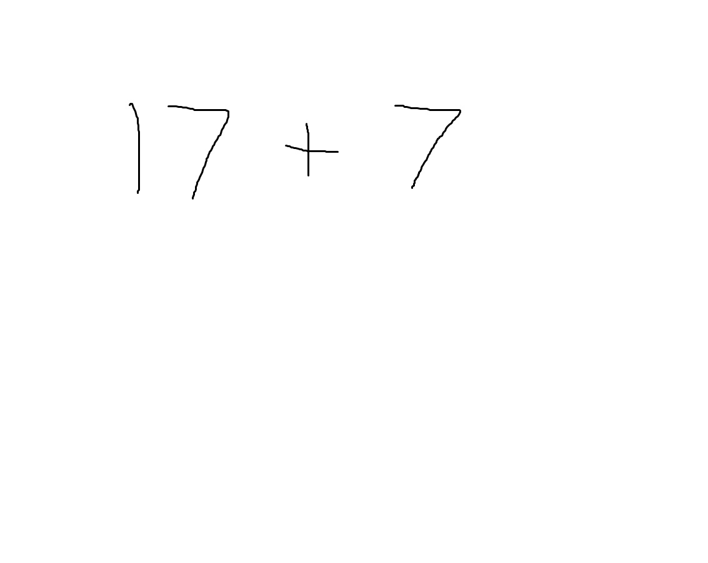
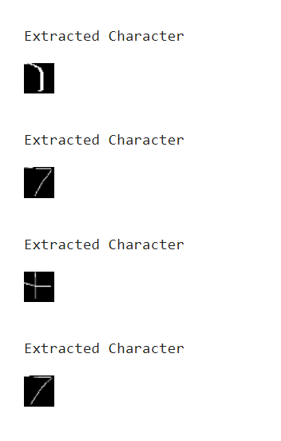
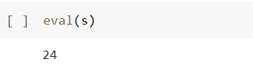

# Handwritten-Equation-Solve
Solving Handwritten Equation using Convolutional Neural Network

# Requirements

1. OpenCV
2. Keras

# Introduction

In this project I have tried to use opencv and pretrain resnet50 model to evaluate handwritten
expressions. To test the project I have created handwritten expressions on paint and loaded the image
into Evaluate_Equation.ipynb

# Code Explained

**1. Extract_data.ipynb**

load images from dataset

image -> grayscale ->image negation

Find contours

sort by boundingRect

Find rectangle with maximum area

Crop image

Resize and reshape image to 1D Array

Append class ( as numbers 0 to 12 )

Store in list and convert to csv

**2. Handwritten_train.ipynb**

import csv using pandas

split into images and labels

convert 1D image to 3D image

Reshape image to (,28,28,3)

import pretrained Resnet50 model and add Dense layer

Train the model

Save the model

**3. Evaluate_Equation.ipynb**

import test image

Convert to grayscale and threshold

Find contours and sort it from left to right

Make list of boundingRect coordinates

loop through list and check if boxes are overlapping

Use boxes to crop image

Fit the model on the cropped image

Use eval function to evaluate expression

# Results

The Resnet model is trained for 10 epochs with a batch size of 200 to an accuracy of 98%

Test image : 

Extracted Characters :

Evaluation Result :

